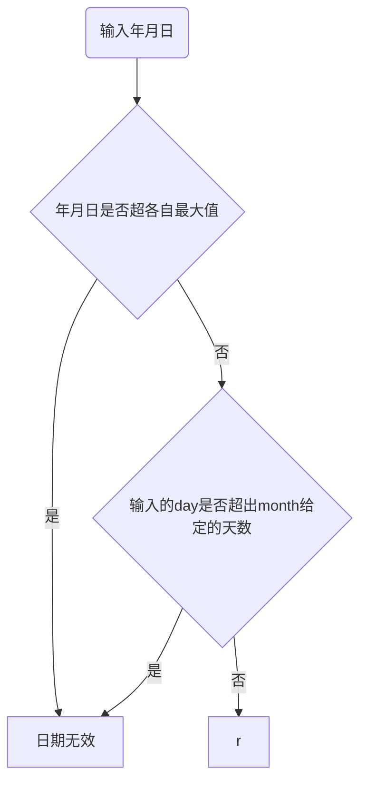

![[Pasted image 20230525183129.png]]

关系是元组的集合

NULL：未知状态

模式：结构的定义

值：模式某一时刻的实例

#### 数据模型三要素
- 数据结构
- 数据操作
- 数据的一致性约束

$$
t[A_i] 取元组某个元素
$$
$$
t[ \{A_i\} ] 取元组的切片
$$

#### Superkey

$$
subset \quad K \quad of \quad R
$$


能够起到唯一标识作用的属性组

一个关系必定至少存在一个超码

#### Candidate key

```
candidate keys:superkeys for which no proper subset is a superkey(mininal superkeys)
```
#### Primary key

被选作唯一标识实体

###### 实体完整性约束：主码任意属性不允许为空


- 主属性：任何候选码的组成属性
- 非主属性


#### Foreign key

在当前关系下不起标识作用

###### 参照完整性：取值参照另一映射关系主码的已有取值，允许设为空


### 数据操作

任何操作的输入输出都是关系

- restrict：挑出满足条件的元组  行选
- project：投影，选出部分属性 列选
- join : 连接运算  表连接

## SQL

- from
- where
- group by
- having
- 
- order by

所有运算都产生一个表，除from外，都只接受一个表的输入参数


两套语言 DML数据操纵语言 DDL 数据定义语言

至少三类类型
- 字符串
- 数值
- 日期
 /opt/software/Gauss/script/gs_checkos -i A -h ecs-cf76 --detail

```sql
numeric(n,m)
n位有效数字，m位小数

varchar() char() 
变长 vs 定长
字符集自动选择
nchar()
unioncode字符集

date 
日期类型 精度问题 （天）

timestamp
时间戳 精确到毫秒


primary key, 
主码
constraint pk_emp 
对emp进行一致性约束


references dept(deptno)
deptno在dept中作为主码
constraint fk_depno


alter table emp
    owner to postgres
更改表的类型


select 选择表 
from 汇总表

select *
from emp,dept  返回emp与dept的笛卡尔积
where emp.a=dept.b; 返回a的外码=b的主码的元组

等效：

from emp join dept on emp.a=dept.b
内连接

from emp left join dept on emp.a=dept.b
外连接 在内连接的结果基础上附加上左侧为连接的内容
from emp right join dept on emp.a=dept.b

from emp full join dept on emp.a=dept.b
全外连接


自然连接
from emp natural join dept 


自连接
from emp natural join emp mgrtable 


where 过滤行
本质是对每个元组的指定元素进行判断


select *
from emp
过滤方式:

数值类

1. 区间
where deptno>=10 and deptno <=30
where deptno between 10 and 30  闭区间 包括端点
where deptno not between 10 and 30  闭区间 包括端点

2. 区间
where depno in(10,20)

3. 不等
where deptno !=10

字符类

1. 判等
where ename ='aaa' 单引号

2. 模式匹配 like
where ename like '____' 

'_' 代表一个字符
'%'代表任意字符
'____%' 4-n个字符
'_o%' 第二个字符为o的

找包含下划线的：
转义字符 \
'%\_%'找包含_的

jjjjjjjjjjjjjjjjjjjjjjjjjjjjjjjjjjjjjjjj       

3. 正则表达式 regular expression ~
where ename ~ '^[AS]$'

开头 '^' 结尾 '$'

'^\w{n,m}$'长度为n-m
'.'单个字符

日期类

where to_char(hiredate,'YYYY')='1980'

select ename,hiredate,date_trunc('month',hiredate)
from emp
where hiredate>to_date('1981/05','YYYY/MM')
大于某个日期的所有值

检索：
where 1=1
      and cond1
      and cond2
      ...


group by  --整体分组，没有先后之分 边建组边加元组

select deptno ,avg(sal)
from emp
group by deptno  


聚合函数忽略null
avg():去掉所有null值
=sum(sal)/count(sal)

计算null
sum(sal)/count(*)


having 过滤分组
可用聚合函数分组

from
where      过滤行
group by   分组
having     过滤分组,若没有 group by,则把输入当成一个分组
select


distinct --对表达式整体元组去重

select count(distinct job) 
--没有分组：将整体看成分组
--有分组 ：对分组内元组执行操作

select distinct deptno
from emp


分支结构的判断 --带标签的输出

case 表达式
如果没收尾，返回null

select ename,sal，
    case 
        when sal between a and b then '中等'
        when ... then 'f'
        else 'fs'
    end saltag


排序 部门a排在前面，其余部门按升序排列

select deptno,ename,sal
from emp
order by
    case 
        when a then 1
        else deptno
    end ,sal,desc;

desc --降序排序


---------------------------------------------------------

在平均工资高于2000的部门工作的员工信息
输出部门编号，员工信息。工资

select deptno,...
from emp
group by deptno
having avg(sal)>2000


嵌套查询/子查询
select deptno ,ename,sal
from emp
where deptno in(
                select deptno
                from emp
                group by deptno
                having avg(sal)>2000
)

                            不相关子查询


exists ()--判断表内有没有元素

select 
from emp
where exists(
                select count(empno)
                from emp e2
                where e2.deptno=emp.deptno
                having avg(sal)>2000
)

                            相关子查询
                        
                    **子查询是否能独立运行**

--------------------------------------------------------


sql语句中用表的地方都能用查询

得到每个员工的姓名 工资，所在部门的平均工资，所处职位的平均工资


select ename,sal,...
from emp join(
                select deptno ,avg(sal)
                from emp
                group by deptno
)  avgdept on emp.deptno=avgdept.deptno
         join(        
                select job ,avg(sal)
                from emp
                group by job
)  avgjob on emp.job=avg.job

--------------------------------------------------------

with 语法
with avgdept as(
                select deptno ,avg(sal) avgsal
                from emp
                group by deptno
),
with avgjob as(
                select job ,avg(sal) avgsal
                from emp
                group by job
)

select ename,sal,...
from emp join avgdept on emp.deptno=avgdept.deptno
         join avgjob on emp.job=avg.job


-------------------------------------------------------

**相关子查询**
select ename,sal,(
    select avg(sal)
    from emp e2
    where e2.deptno=dept.deptno
)deptavg
from dept


--返回任意部门的平均工资

-------------------------------------------------------

--找到所在职位平均工资职位在1000-2500之间的人，要求输出姓名，职位，工资


select ename,job,sal
from emp
where deptno =some(
        select deptno
        from emp
        group by deptno
        having avg(sal) between 1000 and 2500
)


some any all


where emp.sal < all(
            select sal
            from emp
            where deptno=10
)


------------------------------------------------------

null计算过程处理

select coalesce(null,0)
--返回从左到右的第一个非空值

select ename,sal,comm,sal+coalesce(com)
from emp


-------------------------------------------------


..不在某范围 not exists/in


找到不在平均工资大于等于5000的员工的工资

select ename,sal,deptno
from emp
where deptno not in(
        select e2.deptno
        from emp e2
        group by e2.deptno
        having avg(sal)>=5000
)

                        **没考虑null**


-------------------------------------------------


查询工资比所在职位的平均工资高的员工


-------------------------------------------------

集合

并集 union
交集 intersect  
差集 excep(minus)


得到平均工资大于2000或不是CLERK或JOB的工资
select avg(sal) from emp
union
select sal from emp where ename not in('CLERK','JOB')

**列名以第一个集合为准**
**集合运算，自动消除重复项**
**union all   保留重复项**

-------------------------------------------------

找到人数小于3人的部门的部门名称，即使这个部门没有员工，也应该输出部门名称

---普通连接

select dname
from emp right join dept on emp.deptno=dept.deptno
group by dname
having count(emptno)<3


-- 不相关子查询

select dname
from dept
where dept.deptno not in(
        select deptno
        from emp
        group by deptno
        having count(emptno)>=3
)

-- 相关子查询


select dname
from dept
where not exists(
        select count(deptno)
        from emp
        where emp.deptno=dept.deptno
        --group by deptno
        having count(deptno)>=3
)


--集合运算

差集

select dname from dept
except
select dname
from ... join...
group by dname
having count(empno)>=3


-------------------------------------------------

with A as (
    
)

-------------------------------------------------

创建视图
类似于函数，封装查询表，简化查询

create view name as
    select * from emp


--基表 base table 真正存储数据的表


视图内通过基表计算得出的新值（比如聚合函数avg,distinct）不能更新


在吗，我想问一下下面两个sql语句的结果有啥区别啊  
select 
section.course_id,section.year,section.semester, count(sec_id), sum(((end_hr - start_hr) * 60 + end_min - start_min)/50)  
from section join time_slot ts on section.time_slot_id = ts.time_slot_id  
group by section.course_id,section.year,section.semester  
  
-------------------------------------------------------------------  
  
with a as(  
   select course_id,semester,year,sum(((end_hr - start_hr) * 60 + end_min - start_min)/50) as during  
   from section join time_slot t on section.time_slot_id = t.time_slot_id  
   group by course_id,semester,year  
),  
b as(  
   select course_id,year,semester,count(sec_id) as num  
   from section  
   group by course_id,year,semester  
)  
select section.course_id,b.year,b.semester,b.num,a.during  
from section join time_slot ts on section.time_slot_id = ts.time_slot_id  
            join a on section.year = a.year and section.semester =a.semester and a.course_id = section.course_id  
            join b on section.year = b.year and section.semester = b.semester and b.course_id = section.course_id  
group by section.course_id,b.year,b.semester,b.num,a.during


```
![[Pasted image 20230506111108.png]]


## 关系代数

![[Pasted image 20230524110704.png]]
$$
 \prod_{name} \sigma_{deptno=10\cap sal>2500}(emp)
$$
$$natural\quad join\quad :\quad \bowtie
$$


```sql
a join b on ...
```
$$
a \bowtie_{\theta}b
$$

找出所有员工姓名及其直接领导的姓名

$$
\prod_{emp.ename,emgr.ename}(emp\bowtie_{\theta}\rho_{emgr}(emp))
$$ 


```sql
select country_name,count(*),min(sal),max(sal)
from emp_details_view
where state_province not in(
    select state_province
    from emp_details_view
    group by state_province
    having avg(sal)>8000
)
group by state_province

```




