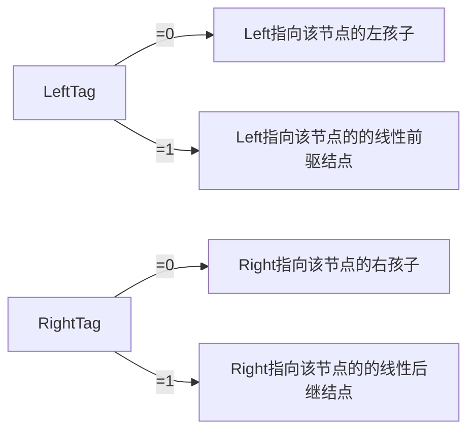

表头1|表头2|表头3|表头4|表头5
---| ---| ---| ---| ---
Left|LeftTag|Date|RightTag|Right


`中序线索化二叉树`
```c++
void ThreadBinTree(NOde *root,Node *&pre)//pre初始值为NULL
{
	Node *Cur=root;
	if(Cur)
	{
		ThreadBinTree(Cur->Left,pre);//中序线索化左子树
		if(!Cur->Left)//左孩子为空
		{
			Cur->Left=pre;
			Cur->LeftTag=1;//建立前驱线索
		}
		if(pre&&!pre->Right)//pre不为空且其右孩子为空
		{
			pre->Right=Cur;
			pre->RightTag=1;//建立后继线索
		}
		pre=Cur;
		ThreadBinTree(Cur->Right,pre);
		}
}
```

`中序遍历线索二叉树`
```c++
void InOrder()
{
	Node *Cur=Root;
	while(!Cur->LeftTag)
		Cur=Cur->Left;
	while(Cur)
	{
		cout<<Cur->date<<" ";
		if(Cur->RightTag)
			Cur=Cur->Right;
		else
		{
			Cur=Cur->Right;
			while(Cur&&!Cur->LeftTag)//找到最左端结点,LeftTag==1 该节点有左孩子
				Cur=Cur->Left;
		}
	}
}
```